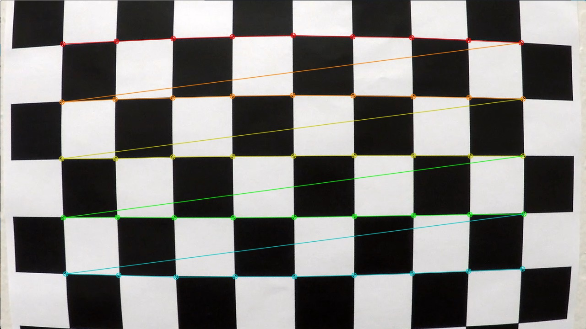
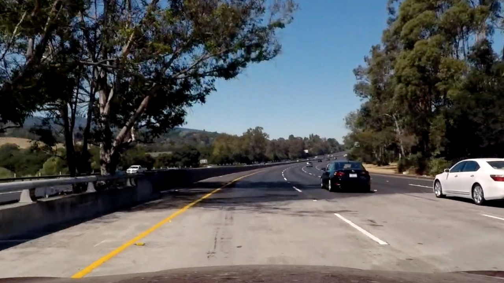
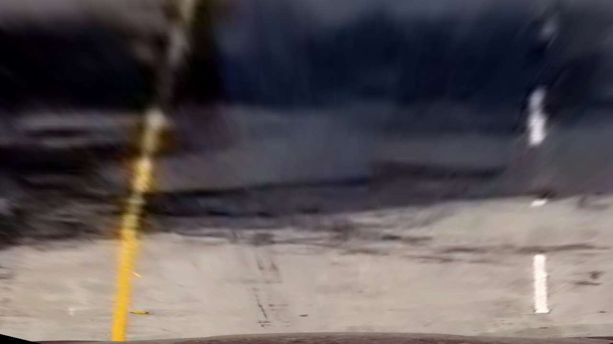

## Advanced Lane Finding
[](http://www.udacity.com/drive)

The goals / steps of this project are the following:  

* Compute the camera calibration matrix and distortion coefficients given a set of chessboard images.
* Apply the distortion correction to the raw image.  
* Use color transforms, gradients, etc., to create a thresholded binary image.
* Apply a perspective transform to rectify binary image ("birds-eye view"). 
* Detect lane pixels and fit to find lane boundary.
* Determine curvature of the lane and vehicle position with respect to center.
* Warp the detected lane boundaries back onto the original image.
* Output visual display of the lane boundaries and numerical estimation of lane curvature and vehicle position.

---

The images for camera calibration are stored in the folder called `camera_cal`.  The images in `test_images` are for testing your pipeline on single frames.  To help the reviewer examine your work, please save examples of the output from each stage of your pipeline in the folder called `ouput_images`, and include a description in the README for the project of what each image shows.    The video called `project_video.mp4` is the video your pipeline should work well on.  

The `challenge_video.mp4` video is an extra (and optional) challenge for you if you want to test your pipeline under somewhat trickier conditions.  The `harder_challenge.mp4` video is another optional challenge and is brutal!

If you're feeling ambitious (again, totally optional though), don't stop there!  We encourage you to go out and take video of your own, calibrate your camera and show us how you would implement this project from scratch!

##Camera Calibration

We have loaded the objectpoints and imagepoints using the chequered calibration images provided in the calibration_cal folder. 
Since there are chequered images with different corner layouts, we load them all using the function ``getimageobjpoints(x,y)``

```
getimageobjpoints(9,5)
getimageobjpoints(9,6)
getimageobjpoints(8,5)
getimageobjpoints(8,6)

```
We have saved the images with the corners marked in the output_images folder with the prefix corners_found.




Using these objectpoints and imagepoints, we have calibrated the camera and stored the calibration parameters
in the calibration folder as ``wide_dist_pickle.p`` . We will reuse this parameter in the later sections to complete the 
rest of the project.

Using the distortion parameters, we have undistorted some test images. The undistorted images are in the output 
directory with the prefix undist. Listed below is an example of undistorted images
 
 
 
## Threshold binary image 

The next stage of our pipeline is to create a thresholded binary image of the camera image. 
For this section, we have created a pipeline function that takes an input image , un distort it 
using the distortion parameters calculated in the above section an then apply bunch of 
image processing functions to arrive at a reasonable thresholded output. 

Please refer to the python notebook where the different test images and their corresponding binary theshold output is 
displayed.

I have used a combination of absolute Sobel operator in X as well as Y direction, Hough transform , 
gradient and magnitude to create the final binary image. 

We have also converted the RGB image to HLS space and used that information to combine and create the final output image. 

The function that performs this operation is the following as shown 

```
def pipeline(img):
    #Take sobel along x and y coordinate
    gradx = abs_sobel_thresh(img, orient='x', thresh=(40, 170))
    grady = abs_sobel_thresh(img, orient='y', thresh=(40, 170))
    #ta
    mag_binary = mag_thresh(img, sobel_kernel=9, mag_thresh=(50, 170))
    dir_binary = dir_threshold(img, sobel_kernel=15, thresh=(0.7, 1.3))
    gradient_combine = combine(gradx,grady,mag_binary,dir_binary)
    hls_image = hls_select(img,(170,255))
    final_img = combine_binary(hls_image,gradient_combine)
    hough = hough_transform(grady)
    final_img = combine_binary(final_img,hough)
    return final_img
```


###Perspective transform

For the perspective transform , we have used the function 

`warped(img)` to get the bird's eye view of the image. 

Following is an example of the image and the perspective transformed image





We have used the src and destination transformations as follows 

```
src=np.float32([(190,720),(1130,720),(724,460),(570,460)])
dst=np.float32([(265,720),(1130,720),(1130,0),(265,0)])
```

### Lane detection algorithm

For the lane detection section, we have followed the following steps 
* Undistort the image using the distortion parameters
* Convert the image to a binary threshold image using the threshold pipeline
* Perform a perspective transform using the `warped` function
* Now we have a binary thresholded and perspective transformed image. 
* We divide the image into 2 sections, into left and right sections. 
* For each section , we divide the image into 100 sections. 
* We perform a histogram on the image to detect the x coordinate of the lane line
