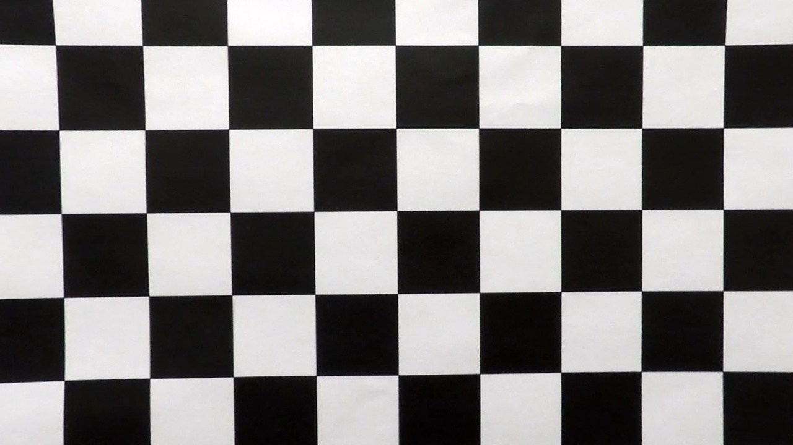

## Advanced Lane Finding

##Camera Calibration

We have loaded the objectpoints and imagepoints using the chequered calibration images provided in the calibration_cal folder. 
Since there are chequered images with different corner layouts, we load them all using the function ``getimageobjpoints(x,y)``

```
getimageobjpoints(9,5)
getimageobjpoints(9,6)
getimageobjpoints(8,5)
getimageobjpoints(8,6)

```
We have saved the images with the corners marked in the output_images folder with the prefix corners_found.


Using these objectpoints and imagepoints, we have calibrated the camera and stored the calibration parameters
in the calibration folder as ``wide_dist_pickle.p`` . We will reuse this parameter in the later sections to complete the 
rest of the project.

Using the distortion parameters, we have undistorted some test images. The undistorted images are in the output 
directory with the prefix undist. Listed below is an example of undistorted images
 
 
 
## Threshold binary image 

The next stage of our pipeline is to create a thresholded binary image of the camera image. 
For this section, we have created a pipeline function that takes an input image , un distort it 
using the distortion parameters calculated in the above section an then apply bunch of 
image processing functions to arrive at a reasonable thresholded output. 

Please refer to the python notebook where the different test images and their corresponding binary theshold output is 
displayed.

I have used a combination of absolute Sobel operator in X as well as Y direction, Hough transform , 
gradient and magnitude to create the final binary image. 

We have also converted the RGB image to HLS space and used that information to combine and create the final output image. 

The function that performs this operation is the following as shown 

```
def pipeline(img):
    #Take sobel along x and y coordinate
    gradx = abs_sobel_thresh(img, orient='x', thresh=(40, 170))
    grady = abs_sobel_thresh(img, orient='y', thresh=(40, 170))
    #ta
    mag_binary = mag_thresh(img, sobel_kernel=9, mag_thresh=(50, 170))
    dir_binary = dir_threshold(img, sobel_kernel=15, thresh=(0.7, 1.3))
    gradient_combine = combine(gradx,grady,mag_binary,dir_binary)
    hls_image = hls_select(img,(170,255))
    final_img = combine_binary(hls_image,gradient_combine)
    hough = hough_transform(grady)
    final_img = combine_binary(final_img,hough)
    return final_img
```


###Perspective transform

For the perspective transform , we have used the function 

`warped(img)` to get the bird's eye view of the image. 

Following is an example of the image and the perspective transformed image


We have used the src and destination transformations as follows 

```
src=np.float32([(190,720),(1130,720),(724,460),(570,460)])
dst=np.float32([(265,720),(1130,720),(1130,0),(265,0)])
```

### Lane detection algorithm

#####Datastructures

We have modelled the Lane Lines using the following DataStructures

######Line Class
```
class Line():
    def __init__(self):
        # was the line detected in the last iteration?
        self.detected = False  
        # x values of the last n fits of the line
        self.recent_xfitted = [] 
        #average x values of the fitted line over the last n iterations
        self.bestx = None     
        #polynomial coefficients averaged over the last n iterations
        self.best_fit = None  
        #polynomial coefficients for the most recent fit
        self.current_fit = [np.array([False])]  
        #radius of curvature of the line in some units
        self.radius_of_curvature = None 
        #distance in meters of vehicle center from the line
        self.line_base_pos = None 
        #difference in fit coefficients between last and new fits
        self.diffs = np.array([0,0,0], dtype='float') 
        #x values for detected line pixels
        self.allx = None  
        #y values for detected line pixels
        self.ally = None
        self.param0 = []
        self.param1 = []
        self.param2 = []
        self.index = 0 
        self.limit = 10
```
###### Vehicle Class
```
class Vehicle():
    def __init__(self):
        #The Left Line 
        self.leftLine = Line()
        
        #The Right Line
        self.rightLine = Line()
        
        #A polygon that determines the detected lane section
        self.polygon = None

```

* The Line class is mainly used to store the historical data for the line. 
* We store an array of previous lane information. This information will be used later in our algorithm
that is described in the section below


##### Lane detection algorithm

For the lane detection section, we have followed the following steps 


 
* Undistort the image using the distortion parameters 

* Convert the image to a binary threshold image using the threshold pipeline 


* Perform a perspective transform using the `warped` function
* Now we have a binary thresholded and perspective transformed image. 
* We apply erode and dilate functions on the perspective transformed image to remove potential 
noise points in the image.


* We divide the image into 2 sections vertically, into left and right sections. 
* For each section , we divide the image horizontally into 100 sections . 
* We perform a histogram that detects the coordinates of the likely point on the lane.
* The function `getleftLanes(warped,minLimit,maxLimit)` and `getrightLanes(warped,minLimit,maxLimit)`
are used to let the likely left and right lane points.


* We have used a polyfit function to fit the line using a 2nd degree polynomial


* Using the potential line parameters, we calculate the curvature of both the left 
and right lane lines. Also we use the pixel to meters conversion to detect the left lane and 
the right lane radius. 
```
left_curverad = ((1 + (2*left_fit_cr[0]*y_eval + left_fit_cr[1])**2)**1.5) \
                                 /np.absolute(2*left_fit_cr[0])
right_curverad = ((1 + (2*right_fit_cr[0]*y_eval + right_fit_cr[1])**2)**1.5) \
                                    /np.absolute(2*right_fit_cr[0])                                    
```
* Next we determine if the lane detected make sense or not . 
* We know from the US government [database](http://onlinemanuals.txdot.gov/txdotmanuals/rdw/horizontal_alignment.htm#BGBHGEGC)
that the radius of turn cannot be below a certain value. We have used a minimum radius of 5000 m 
 for the test
* If the radius of either the left or right radius is below this minimum value, then it means 
that one of the lanes is detecting a turn. 
* If any lane detects a turn, then both the lanes should point to a turn. If the 2 turns point to a turn and 
if the difference between both the lane's radius is less than 2000 m , then we know that the both the lanes are detected correctly.
* If the lane is detected correctly, we add this line's data to our Line class's data.
* If the lane is not detected correctly, we do not add this line's data cache.
* The data in the Line class is a moving average of the previously detected Lane lines.
* The moving average is of size 10 . 
* When we finally decide to plot the polygon for the Line detection, we use the average of the line's 
polygon data to decide the final line data. 
* Using this mechanism allows us to smoothly plot the polygon and makes the detection more resilient to 
infrequent incorrect detections that occur in an image with a shadow or when the color of the road changes etc.
* We superimpose the polygon onto the perspective transformed image

* At last, we plot the information on the image.
* To get the distance of the vehicle from the center of the road, we use the following logic.
* We get the 2 bottom points of both right and left lane lines. 
* Using that information, we get the center pixel of the lane according to our calculations. 
* We take the difference of that with the center of the image . 
* The assumption is that the camera is located on the center of the car. 
* Using the difference in pixel space, we convert that to meters. 

```
 # Define conversions in x and y from pixels space to meters
    ym_per_pix = 30/720 # meters per pixel in y dimension
    xm_per_pix = 3.7/700 # meteres per pixel in x dimension
  

screen_middel_pixel = img.shape[1]/2
    car_middle_pixel = int((right_lane_start + left_lane_start)/2)
    screen_off_center = screen_middel_pixel-car_middle_pixel
    meters_off_center = abs(xm_per_pix * screen_off_center)
  

```
* We use the inverse perspective transform to convert the image back to the original perspective.

* If we detect the lane line successfully, we use the term *Locked* and if we dont detect the image successfully,
we use the term *Lost* on the image.
* We have plotted the results on the python notebook.


This is a link to my [video result](output.mp4)

This is a link posted on [youtube](https://www.youtube.com/watch?v=CVzUjia7WW0&feature=youtu.be)

### Discussion 

This was one of the more challenging projects. 

Image processing is not easy and simple common things that happen in the 
real world such as shadows, different lighting conditions , different road conditions , different times of the day, unmarked roads, 
construction zones, rain , road reflections off water etc all pose challenges in correct line detection. 

Image processing can be one of the ways to detect lanes but definitely not the only way. I have used a very simplistic model to detect 
lane prediction with confidence but it is not the best model. More work is required to detect if the lane detected is correct or not. 

The current pipeline does not work very well with the challenge video. 


